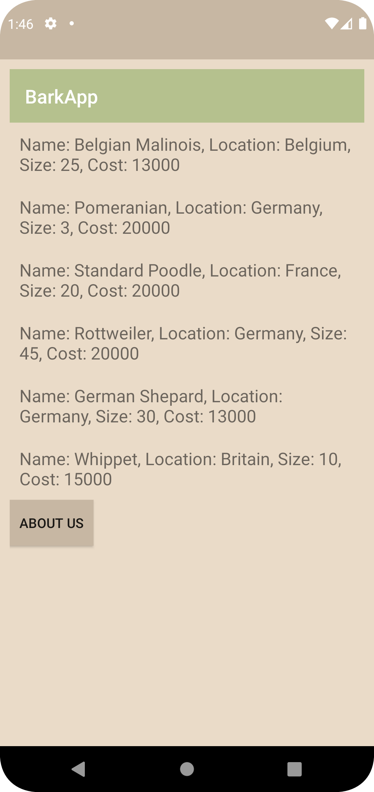
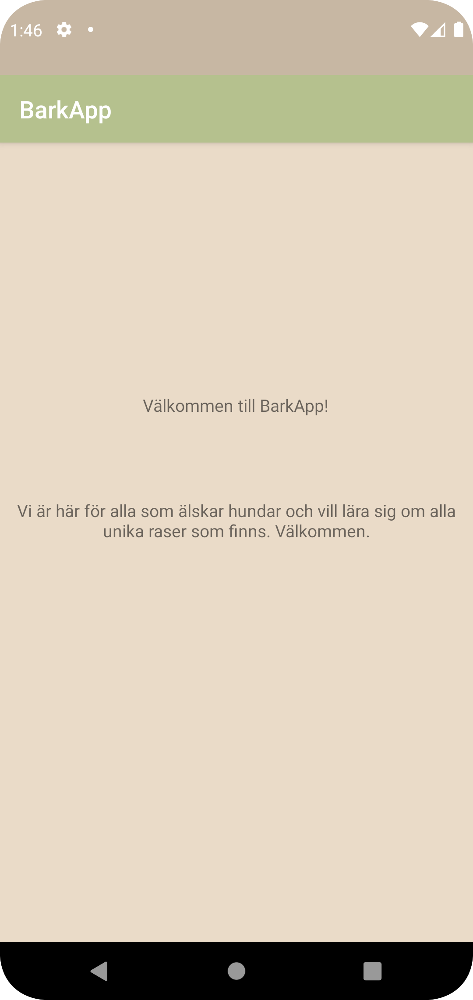

# Rapport
Det första som gjordes var att lägga till en recycler view. Sedan behövdes en Dogs class göras och skrivas in data i den, mountain klassen gjordes sedan till en array. En recycleviewadapter klass har också skapats för att kunna skriva ut information om hundarna. Sedan användes Gson för att kunna parsa ut Json data som hundraserna låg i.


```
<androidx.recyclerview.widget.RecyclerView
android:id="@+id/recycler_view"
android:layout_width="match_parent"
android:layout_height="match_parent"
app:layout_constraintBottom_toBottomOf="parent"
app:layout_constraintLeft_toLeftOf="parent"
app:layout_constraintRight_toRightOf="parent"
app:layout_constraintTop_toTopOf="parent" />
```

```
public class Dogs {

    public String ID;
    @SerializedName("name")
    public String name;


    @SerializedName("location")
    public String location;

    @SerializedName("size")

    public String size;
    @SerializedName("cost")

    public String cost;
    public Dogs() {
        name = "Breed name:";
        location = "Originated:";
        size = "Aprox weight:";
        cost = "Aprox cost:";
    }

    public Dogs(String name) {
        this.name = name;
        this.cost = cost;
        this.location = location;
        this.size = size;
    }

    @NonNull
    @Override
    public String toString() {
        return "Name: " + name + ", Location: " + location + ", Size: " + size + ", Cost: " + cost;
    }

```
```
RecyclerViewAdapter adapter = new RecyclerViewAdapter(this, Breeds, new RecyclerViewAdapter.OnClickListener() {
@Override
public void onClick(Dogs item) {
Toast.makeText(MainActivity.this, item.toString(), Toast.LENGTH_SHORT).show();
}
});
```
```
Gson gson = new Gson();
Type type = new TypeToken<List<Mountain>>() {
}.getType();
Breeds = gson.fromJson(json, type);
```
Bilder läggs i samma mapp som markdown-filen.




